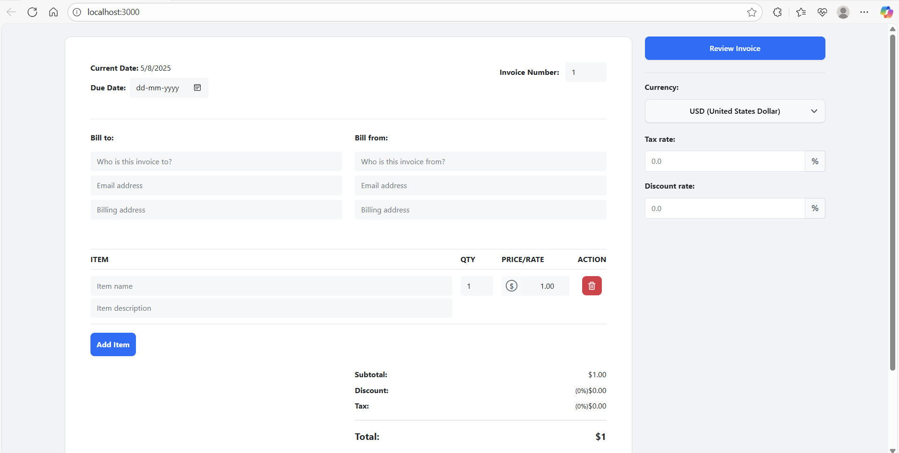

# 🖨️ InfoPress



## 📄 Overview

**InfoPress** is a lightweight React-based application that converts structured information into downloadable PDF files. It's designed for use cases like report generation, resume creation, form exports, and more — all with just one click.

## 🚀 Features

- Convert input data into professional PDFs
- One-click PDF generation
- Fully responsive and clean UI
- Built using modern React components
- Fast and lightweight output

## 🛠️ Tech Stack

- ⚛️ React
- 📦 JavaScript
[html2pdf.js](https://github.com/eKoopmans/html2pdf) *(if applicable)*  
- 🎨 Custom CSS

## 📦 Getting Started

```bash
# Clone the repository
git clone https://github.com/your-username/infopress.git

# Navigate into the project directory
cd infopress

# Install dependencies
npm install

# Run the app
npm start
